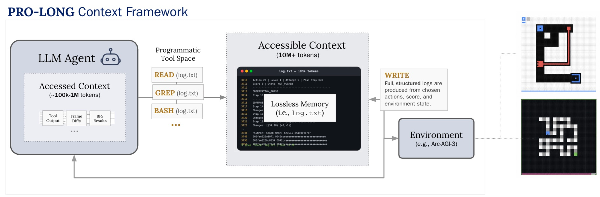

# Reproduction status: setup-blocked

[](https://molab.marimo.io/github/alphaXiv/pro-long-904f95ab/blob/main/reports/pro-long-reproduction/notebook.py)

This public repository contains a bounded reproduction attempt of the central claim in [PRO-LONG (arXiv:2607.20064)](https://arxiv.org/abs/2607.20064): under the same agent and action budget, a complete structured history should beat last-25 and no-log controls, while programmatic retrieval should improve score per token. We prepared `g50t`, `m0r0`, and `ls20` with 120 actions/game for full-log, last-25, no-log, and stateless conditions using GPT-5.4 Codex. All corrected OpenResearch Kubernetes jobs completed, but `ARC_API_KEY` was absent, so **zero fresh ARC episodes ran and the claims are unassessed**.

The paper reports 41.2% pass@1 for full-log GPT-5.5 versus 24.0% for no-log on 25 games. This attempt observed no score rather than a contradictory number. Downscaling was three games instead of 25, 120 actions instead of 500, and GPT-5.4 instead of GPT-5.5. Compute used Kubernetes on an NVIDIA RTX PRO 6000 Blackwell cluster; this API-driven workload allocated 0 GPUs at peak, ran four CPU jobs concurrently, and took 222 seconds (0.0617 hours) wall time.

Read the [illustrated report](reports/pro-long-reproduction/report.md), explore the [self-contained marimo notebook](reports/pro-long-reproduction/notebook.py), or inspect the embedded [result summary](reports/pro-long-reproduction/results.json).

## Experiment log

| Branch / experiment | Purpose or change | Exact run command | Assessment / outcome | Compute |
|---|---|---|---|---|
| `main` | Public report, notebook, and reusable harness | Not run as an experiment (publication surface) | Presentation-only | — |
| [`orx/fresh-full-log-3-game-baseline`](https://github.com/alphaXiv/pro-long-904f95ab/tree/orx/fresh-full-log-3-game-baseline) | Frozen root; exposed the injected-script wrapper error | `bash reproduction/run.sh` | Infrastructure failure before setup; zero episodes | Kubernetes, CPU-only, 10s |
| [`orx/corrected-kubernetes-full-log-baseline`](https://github.com/alphaXiv/pro-long-904f95ab/tree/orx/corrected-kubernetes-full-log-baseline) | Full structured log; corrected Kubernetes wrapper | `bash reproduction/run.sh` | Setup-blocked: `ARC_API_KEY` absent; zero episodes | Kubernetes, CPU-only, 68s |
| [`orx/corrected-last-25-control`](https://github.com/alphaXiv/pro-long-904f95ab/tree/orx/corrected-last-25-control) | Expose only the last 25 action sections | `bash reproduction/run.sh` | Setup-blocked: `ARC_API_KEY` absent; zero episodes | Kubernetes, CPU-only, 68s |
| [`orx/corrected-no-log-control`](https://github.com/alphaXiv/pro-long-904f95ab/tree/orx/corrected-no-log-control) | Inject current board; no automatic log in workspace | `bash reproduction/run.sh` | Setup-blocked: `ARC_API_KEY` absent; zero episodes | Kubernetes, CPU-only, 63s |
| [`orx/corrected-stateless-control`](https://github.com/alphaXiv/pro-long-904f95ab/tree/orx/corrected-stateless-control) | Full log with workspace cleared between calls | `bash reproduction/run.sh` | Setup-blocked: `ARC_API_KEY` absent; zero episodes | Kubernetes, CPU-only, 52s |

---

# PRO-LONG: Programmatic Memory Enables Long-Horizon Reasoning

PRO-LONG is a minimal memory addition for LLM agents on long-horizon tasks. Our harness appends every observation, action, and outcome verbatim to a single structured log.txt, and the agent retrieves and reasons over it programmatically (grep, Python). We use no subagents or specalized retrieval mechanisms, and use a ~30-line prompt.

On the full [ARC-AGI-3](https://three.arcprize.org/) public game set, PRO-LONG improves over the same coding agents without the log by 18 percentage points on average, matches or exceeds specialized harnesses at 4.2–5.8x fewer billed tokens, and reaches **97.4% best@2 with Fable 5 at a total cost of $1,750**.

**Paper:** [arxiv.org/abs/2607.20064](https://arxiv.org/abs/2607.20064)



## Setup

Requires Python (3.12 recommended) and Docker.

```bash
git clone git@github.com:alexisfox7/PRO-LONG.git
cd PRO-LONG
python -m venv .venv
source .venv/bin/activate
pip install -e .

# build the sandbox + egress-proxy images for the backend(s) you use
docker build -t rgb-agent/codex-sandbox:latest docker/codex-sandbox
docker build -t rgb-openai-proxy docker/openai-proxy
docker build -t rgb-agent/claude-sandbox:latest docker/claude-sandbox
docker build -t rgb-anthropic-proxy docker/anthropic-proxy
```

Create a `.env` file:

```
ARC_API_KEY=...
ANTHROPIC_API_KEY=...   # claude-code backend
OPENAI_API_KEY=...      # codex backend
```

## Usage

```bash
prolong-swarm --suite all --max-actions 500                       # codex backend (default)
prolong-swarm --suite all --backend claude-code -m claude-opus-4-6
prolong-swarm --game ls20,ft09
```

### Key flags

| Flag | Default | Description |
|------|---------|-------------|
| `--backend` | `codex` | Agent backend: `codex` (OpenAI Codex CLI) or `claude-code` (Claude Code CLI) |
| `--suite` | — | Predefined game suites (e.g. `ls20`, `vc33`, `ft09`, or `all`) |
| `--game` | — | Comma-separated game names or IDs (alternative to `--suite`) |
| `--max-actions` | 500 | Max actions per game |
| `--model`, `-m` | `claude-opus-4-6` | Analyzer model |
| `--effort` | `high` | Effort level (claude-code backend) |
| `--reasoning-effort` | `none` | Reasoning effort (codex backend) |
| `--operation-mode` | `online` | `online` / `offline` / `normal` |

### Memory conditions

The analyzer's access to game history is controlled by `--log-window` (and `--workspace`). These are the ablation conditions from the paper:

| Condition | Flags | What the analyzer sees |
|-----------|-------|------------------------|
| prolong | (default) | Full game log, read from a file in its workspace |
| lw25 | `--log-window 25` | Last 25 action sections of the log |
| no-log (in-prompt) | `--log-window -1` | No log file; the current board is injected into the prompt (history limited to context) |
| stateless | `--workspace stateless` | Full log, but the workspace is wiped each call (no carried-over notes/files) |

Results are saved to `evaluation_results/`.

## Scorecards & logs

Official online scorecards (verifiable on arcprize.org) are in [`scorecards/`](scorecards/), including all 25 Fable 5 runs behind the paper's headline result (`fable_online_scorecards.txt`). Full sanitized logs for the Fable 5 online runs (game logs, agent transcripts, and workspaces) are in [`release_logs/`](release_logs/); logs for the remaining cohorts are being released separately.

## Architecture

The analyzer agent (Codex CLI or Claude Code CLI) runs in a sandboxed Docker container, reads the game's log with read/grep/Python, and outputs a JSON action plan. The action queue drains these one per step with zero LLM calls. When the queue empties or the score changes, the analyzer re-fires.

```
prolong_agent/
├── agent/
│   ├── base.py               # Backend-agnostic analyzer interface
│   ├── codex_agent.py        # Codex CLI backend (Docker sandbox)
│   ├── claude_code_agent.py  # Claude Code CLI backend (Docker sandbox)
│   ├── swarm.py              # CLI entry; runs games in parallel on a scorecard
│   ├── action_queue.py       # Drains one action per step (batched plans + score-change flush)
│   ├── game_state.py         # Board/log formatting
│   └── prompts.py            # System + user prompts (~30 lines for PRO-LONG)
├── environment/
│   ├── arcagi3.py            # ARC-AGI-3 API wrapper (reset, step, scoring)
│   ├── runner.py             # Per-game orchestration loop
│   └── config.py
├── metrics/
└── utils/
```

> This repo was formerly the Read-Grep-Bash (RGB) Agent — see the original [blog post](https://blog.alexisfox.dev/arcagi3) on the ARC-AGI-3 preview games.

## Citation

```bibtex
@misc{fox2026prolong,
  title={PRO-LONG: Programmatic Memory Enables Long-Horizon Reasoning},
  author={Fox, Alexis and Wang, Junlin and Rosu, Paul and Dhingra, Bhuwan},
  year={2026},
  eprint={2607.20064},
  archivePrefix={arXiv},
  primaryClass={cs.AI},
  url={https://arxiv.org/abs/2607.20064},
}
```
