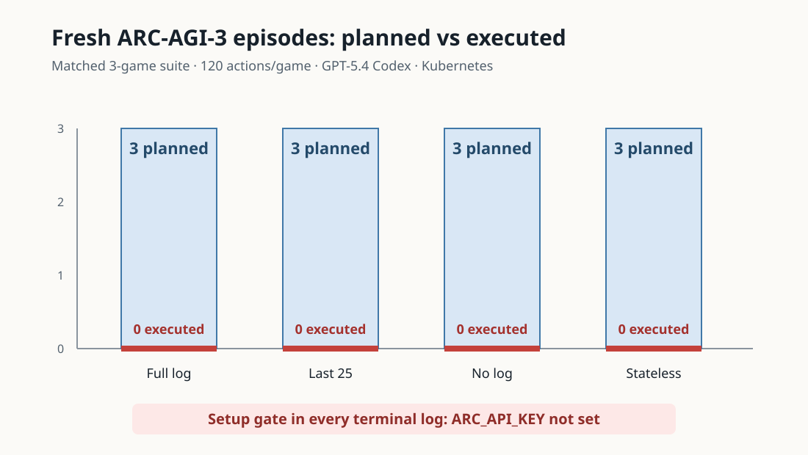
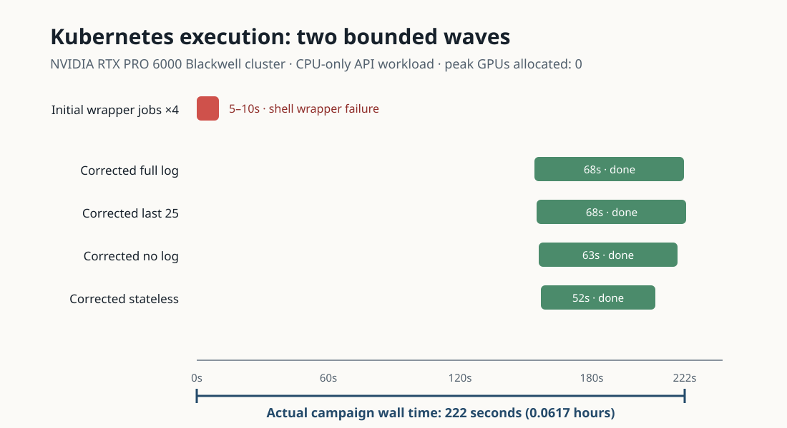
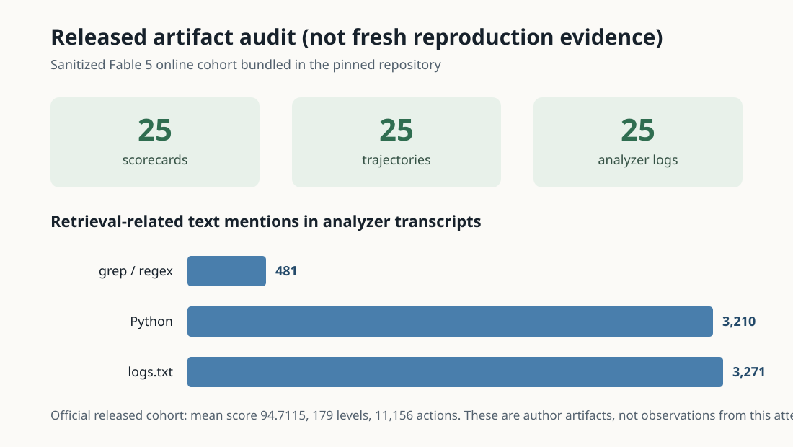

# PRO-LONG reproduction: a credential-gated result

Long-running game agents can forget the evidence they gathered hundreds of moves ago. PRO-LONG’s simple idea is to keep every interaction in a structured file and let a coding agent search it with familiar tools; this reproduction set out to test whether that full history beats truncated or absent history on the public ARC-AGI-3 games.

## Verdict

**Not reproduced — setup blocked, so both target claims remain unassessed.** Four matched conditions were prepared for `g50t`, `m0r0`, and `ls20` at 120 actions per game using GPT-5.4 Codex, but every corrected Kubernetes terminal log reported that `ARC_API_KEY` was absent. The jobs executed zero fresh ARC episodes; no score, level-completion, token-efficiency, or tool-ladder comparison exists for this attempt.

How to read this figure: each pale bar is the three-game workload that would have run under one memory condition. The red baseline is what actually ran—zero episodes in all four conditions—so equal zeros are a setup outcome, not evidence that the conditions perform equally.

## What the paper claims

The [paper](https://arxiv.org/abs/2607.20064) reports that full-log PRO-LONG reaches 41.2% pass@1 with GPT-5.5 versus 24.0% for its no-log coding-agent control on all 25 public games. Its tool ladder rises from 23.1% with read-only access to 27.2% with grep, 38.3% with Python, and 41.2% with write/edit; clearing the workspace changes full-log performance only from 41.2% to 40.7%, while no-log falls from 24.0% to 19.9%.

The attempted test deliberately narrowed coverage, not the claim: three public games, four memory conditions, the same model, prompt family, action cap, retries, representation, and budget. GPT-5.4 replaced the paper’s GPT-5.5. The action budget was 120 rather than 500. These substitutions would have made any result a bounded partial reproduction, not a recreation of the headline table.

| Claim | Paper result | Observed here | Assessment |
|---|---:|---:|---|
| Full log beats no log / last 25 | 41.2% vs 24.0% no-log on the full GPT-5.5 suite | No score; 0 episodes | Inconclusive under setup gate |
| Programmatic retrieval improves token efficiency | Tool ladder 23.1 → 41.2%; 4.2–5.8× headline token savings versus specialized harnesses | No model turns; no billed-token comparison | Inconclusive under setup gate |
| Full log does not depend on persistent notes | 41.2% persistent vs 40.7% stateless | No score; 0 episodes | Inconclusive under setup gate |

## Implementation and execution

The public harness pins Node 22.17.1 and Codex CLI 0.145.0, installs the released Python package, and prints the full protocol before acting. A Kubernetes adapter runs Codex directly because nested Docker is unavailable; its subprocess environment removes `ARC_API_KEY`, preserving the original separation between the game client and the model. Conditions are committed as small JSON changes: `log_window=null`, `25`, or `-1`, and `workspace=stateless`.

The first four jobs revealed one wrapper error before repository setup. The frozen root was preserved; a child changed the manifest to evaluate the injected OpenResearch script, and four corrected jobs then completed with nonempty logs.

Kubernetes ran on a cluster of NVIDIA RTX PRO 6000 Blackwell GPUs. Because ARC interaction and model inference are remote APIs, the jobs were CPU-only: peak concurrent GPU allocation was **0**, peak concurrent jobs was four, and the queue-verified wall time was **223.362 seconds (0.062045 hours)**. The publication schema rejects zero, so `autoresearch.json` records its minimum valid `gpuCount` of 1; the manifests and terminal logs remain the source of truth for the measured allocation.

## What the released artifacts establish

Each corrected run audited the pinned sanitized release: 25 official scorecards, 25 trajectories, and 25 analyzer transcripts with SHA-256 `21a2eebf…d358e`. The cohort’s mean official score is 94.7115 across 179 completed levels and 11,156 actions. Transcript text contains extensive references to `logs.txt`, Python, and grep/regex, consistent with the mechanism described in the paper.

This is provenance and code-path evidence only. It does not compare matched conditions, re-bill tokens, or replace the named public benchmark run; the released Fable 5 measurements are author evidence.

## Limits and next executable step

The missing ARC credential is the sole scientific gate observed after the runtime repair; OpenAI credentials were present and Codex was on `PATH`. Supplying `ARC_API_KEY` to the OpenResearch Kubernetes environment is enough to activate the already-published four-condition protocol. A stronger follow-up should restore the paper’s 500-action budget, add repeated runs for variance, and then extend the same tree with read-only, grep, and Python tool-ladder children.

Branches: [corrected full log](https://github.com/alphaXiv/pro-long-904f95ab/tree/orx/corrected-kubernetes-full-log-baseline), [last 25](https://github.com/alphaXiv/pro-long-904f95ab/tree/orx/corrected-last-25-control), [no log](https://github.com/alphaXiv/pro-long-904f95ab/tree/orx/corrected-no-log-control), and [stateless](https://github.com/alphaXiv/pro-long-904f95ab/tree/orx/corrected-stateless-control).
